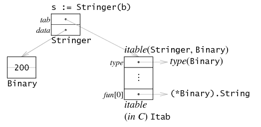
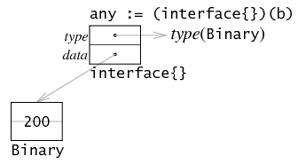

Что выведет программа? Объяснить вывод программы. 
Объяснить внутреннее устройство интерфейсов и их отличие от пустых интерфейсов.

```go
package main
 
import (
    "fmt"
    "os"
)
 
func Foo() error {
    var err *os.PathError = nil
    return err
}
 
func main() {
    err := Foo()
    fmt.Println(err)
    fmt.Println(err == nil)
}
```
Ответ:
```
<nil>
false
```
ZeroValue для интерфейса - `nil` для типа и значения (поля `tab` и `data` в `ifce`). 
Но при возвращении интерфейса из функции (error в данном примере), то в качестве динамического типа
будет присвоенный объект (`*os.PathError`), а в качестве данных `nil`. Поэтому `err!=nil` тк в возвращаемом интерфейсе 
хранится мета информация о динамическом типе, хотя самих данных нет. Интерфейс может быть == nil только когда у него нет, ни конкретного типа, ни значения конкретного типа

`Интерфейс` - Абстрактный тип представляющий собой контракт, определяющий поведение. Он объявляет набор
сигнатур методов. Реализация интерфейса неявная (утиная), те чтобы объект реализовывал интерфейс достаточно иметь все методы объявленные в интерфейсе.

**Внутреннее устройство**:

`Интерфейс` - структура, содержащая информацию о себе и типе, который ее реализует:
```go
type iface struct {
	tab *itab // Мета информация об интерфейсе и типе, который ее реализует, ее методы и тд.
	data unsafe.Pointer // Данные типа, который реализует интерфейс
}
```
Когда вызывается метод объекта, который представлен интерфейсом `var s io.Writer = MyWriter{}; s.Write([]byte("hello"))`,
то вызывается конкретный метод интерфейса, который мапится с методом динамического типа.
```go
type itab struct {
	inter *interfacetype // метаданные интерфейса (сигнатуры методов и тд)
	_type *_type // Динамический тип - то что положено при runtime.  
	hash  uint32 // Высчитанный хэш у _type для быстрых type asserts и switch. Позволяющий проводить утверждение динамического типа
	_     [4]byte // Выравнивание струтуры в памяти
	fun   [1]uintptr // Список с указателями на методы динамического типа, удовлетворяющих интерфесу. (указатель в целочисленном представлении на список, в котором хранятся указатели на функции динамического типа)
}
```



**Пусто интерфейс `interface{}`**

`Пустой интерфейс` не предоставляет методов, то есть не задает правил, поэтому он удовлетворяет всем типам.
Из-за этого поле `itab` опускается и остается только указатель на сам тип - имеется только поле `data unsafe.Pointer`.



